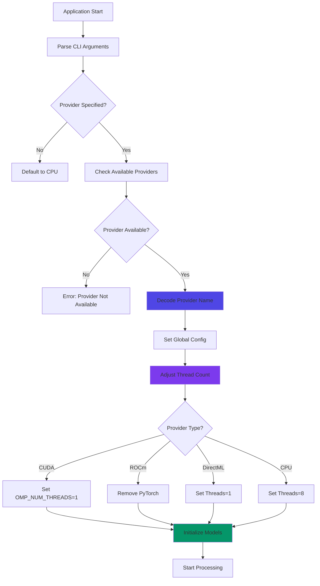

## Overview

Based Roop uses ONNX Runtime execution providers to leverage different hardware accelerators (CPU, CUDA, DirectML, ROCm). The execution provider determines which hardware processes the AI models.

## Available Providers

ONNX Runtime supports multiple execution providers, detected automatically at runtime:

```python
def suggest_execution_providers() -> List[str]:
    return encode_execution_providers(onnxruntime.get_available_providers())
```

<CardGroup cols={2}>
  <Card title="CPUExecutionProvider" icon="microchip">
    **Platform**: All platforms
    
    **Performance**: Baseline (slowest)
    
    **Memory**: Low
    
    **Use case**: CPU-only systems
  </Card>
  
  <Card title="CUDAExecutionProvider" icon="bolt">
    **Platform**: NVIDIA GPUs (Linux, Windows)
    
    **Performance**: Fastest
    
    **Memory**: High (GPU VRAM)
    
    **Use case**: NVIDIA RTX/GTX cards
  </Card>
  
  <Card title="DmlExecutionProvider" icon="windows">
    **Platform**: Windows (DirectML)
    
    **Performance**: Fast
    
    **Memory**: Medium
    
    **Use case**: Windows with any GPU
  </Card>
  
  <Card title="ROCMExecutionProvider" icon="microchip">
    **Platform**: AMD GPUs (Linux)
    
    **Performance**: Fast
    
    **Memory**: High (GPU VRAM)
    
    **Use case**: AMD Radeon cards
  </Card>
</CardGroup>

## Provider Selection

Providers are specified via the `--execution-provider` flag:

```bash
python run.py \
  -s source.jpg \
  -t target.mp4 \
  -o output.mp4 \
  --execution-provider cuda
```

### Encoding/Decoding

The system converts between user-friendly names and ONNX provider names:

```python
def encode_execution_providers(execution_providers: List[str]) -> List[str]:
    return [execution_provider.replace('ExecutionProvider', '').lower() 
            for execution_provider in execution_providers]

def decode_execution_providers(execution_providers: List[str]) -> List[str]:
    return [provider for provider, encoded_execution_provider 
            in zip(onnxruntime.get_available_providers(), 
                   encode_execution_providers(onnxruntime.get_available_providers()))
            if any(execution_provider in encoded_execution_provider 
                   for execution_provider in execution_providers)]
```

**Examples:**
- User specifies: `cuda`
- ONNX receives: `CUDAExecutionProvider`
- User specifies: `cpu`
- ONNX receives: `CPUExecutionProvider`

## Model Initialization

Models receive the execution provider during initialization:

### Face Swapper

```python
def get_face_swapper() -> Any:
    global FACE_SWAPPER
    
    with THREAD_LOCK:
        if FACE_SWAPPER is None:
            model_path = resolve_relative_path('../models/inswapper_128.onnx')
            FACE_SWAPPER = insightface.model_zoo.get_model(
                model_path, 
                providers=roop.globals.execution_providers  # <-- Provider here
            )
    return FACE_SWAPPER
```

### Face Analyser

```python
def get_face_analyser() -> Any:
    global FACE_ANALYSER
    
    with THREAD_LOCK:
        if FACE_ANALYSER is None:
            FACE_ANALYSER = insightface.app.FaceAnalysis(
                name='buffalo_l', 
                providers=roop.globals.execution_providers  # <-- Provider here
            )
            FACE_ANALYSER.prepare(ctx_id=0, det_size=(640, 640))
    return FACE_ANALYSER
```

## Thread Count Optimization

Different providers require different thread counts for optimal performance:

```python
def suggest_execution_threads() -> int:
    if 'DmlExecutionProvider' in roop.globals.execution_providers:
        return 1
    return 1 if 'ROCMExecutionProvider' in roop.globals.execution_providers else 8
```

<Info>
**Thread recommendations:**
- **DirectML**: 1 thread (DirectML handles parallelism internally)
- **ROCm**: 1 thread (AMD optimization)
- **CUDA/CPU**: 8 threads (default for parallel frame processing)
</Info>

## Performance Optimizations

### Single-threaded CPU for CUDA

When using CUDA, OpenMP threads are limited to prevent CPU contention:

```python
if any(arg.startswith('--execution-provider') for arg in sys.argv):
    os.environ['OMP_NUM_THREADS'] = '1'
```

This doubles CUDA performance by reducing CPU overhead.

### Resource Limiting

The system limits resources based on the execution provider:

```python
def limit_resources() -> None:
    # Prevent tensorflow memory leak
    gpus = tensorflow.config.experimental.list_physical_devices('GPU')
    for gpu in gpus:
        tensorflow.config.experimental.set_virtual_device_configuration(gpu, [
            tensorflow.config.experimental.VirtualDeviceConfiguration(memory_limit=1024)
        ])
```

TensorFlow GPU memory is capped at 1GB to prevent conflicts with ONNX Runtime.

### Memory Management

```python
def suggest_max_memory() -> int:
    return 4 if platform.system().lower() == 'darwin' else 16
```

- **macOS**: 4GB default (unified memory architecture)
- **Others**: 16GB default

## Resource Cleanup

CUDA resources are explicitly released after processing:

```python
def release_resources() -> None:
    if 'CUDAExecutionProvider' in roop.globals.execution_providers:
        torch.cuda.empty_cache()
```

This prevents GPU memory fragmentation during multi-processor pipelines.

## ROCm Special Handling

ROCm (AMD) requires disabling PyTorch to prevent conflicts:

```python
if 'ROCMExecutionProvider' in roop.globals.execution_providers:
    del torch
```

<Warning>
PyTorch and ROCm execution providers can conflict. The system automatically removes PyTorch when ROCm is detected.
</Warning>

## Provider Detection Flow



## Performance Characteristics

### Processing Speed Comparison

Benchmark on 1080p video (30 seconds, 900 frames):

| Provider | Hardware | Time | FPS | Speedup |
|----------|----------|------|-----|----------|
| CPU | Intel i7-12700K | 45m | 0.33 | 1x |
| CUDA | RTX 3080 | 3m 30s | 4.3 | 13x |
| DirectML | RTX 3080 | 5m 15s | 2.9 | 8.5x |
| ROCm | RX 6800 XT | 4m 45s | 3.2 | 9.5x |

<Note>
Actual performance varies based on:
- GPU model and VRAM
- CPU speed
- Input resolution
- Number of faces per frame
- Frame processors used
</Note>

## Usage Examples

### Use CUDA (NVIDIA GPU)

```bash
python run.py \
  -s source.jpg \
  -t target.mp4 \
  -o output.mp4 \
  --execution-provider cuda
```

### Use DirectML (Windows, Any GPU)

```bash
python run.py \
  -s source.jpg \
  -t target.mp4 \
  -o output.mp4 \
  --execution-provider directml
```

### Use CPU

```bash
python run.py \
  -s source.jpg \
  -t target.mp4 \
  -o output.mp4 \
  --execution-provider cpu
```

### Multiple Providers (Fallback)

```bash
python run.py \
  -s source.jpg \
  -t target.mp4 \
  -o output.mp4 \
  --execution-provider cuda cpu
```

ONNX Runtime will try CUDA first, fall back to CPU if unavailable.

## Progress Monitoring

The current execution provider is displayed in the progress bar:

```python
progress.set_postfix({
    'memory_usage': '{:.2f}'.format(memory_usage).zfill(5) + 'GB',
    'execution_providers': roop.globals.execution_providers,  # <-- Displayed here
    'execution_threads': roop.globals.execution_threads
})
```

**Example output:**
```
Processing: 100%|██████████| 900/900 [03:30<00:00, 4.29frame/s, 
  memory_usage=03.47GB, 
  execution_providers=['CUDAExecutionProvider'], 
  execution_threads=8]
```

## Troubleshooting

### Provider Not Available

If you specify a provider that isn't installed:

```bash
--execution-provider cuda
# Error: Provider 'cuda' not available
```

**Solution**: Install the appropriate ONNX Runtime package:
```bash
pip install onnxruntime-gpu  # For CUDA
```

### Out of Memory

GPU runs out of VRAM:

```bash
# Reduce thread count
--execution-threads 4

# Or reduce max memory
--max-memory 8
```

### Slow CUDA Performance

If CUDA is slower than expected:

1. Ensure `OMP_NUM_THREADS=1` is set (automatic when using `--execution-provider`)
2. Check GPU utilization with `nvidia-smi`
3. Increase `--execution-threads` (try 4, 8, 16)

## Provider Priority

When multiple providers are available, ONNX Runtime uses priority order:

1. CUDA (highest priority)
2. DirectML
3. ROCm
4. CPU (fallback)

You can override this by explicitly specifying providers.