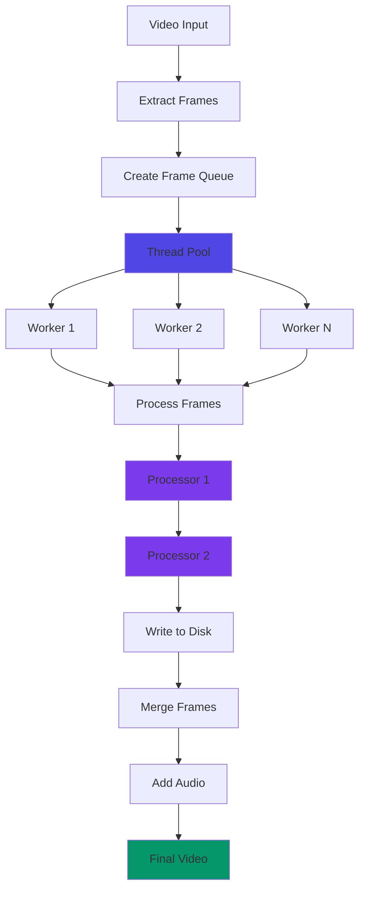

## Overview

Based Roop uses a modular frame processor architecture that allows multiple processing steps to be chained together. Each processor implements a standard interface defined in `processors/frame/core.py`.

## Processor Interface

Every frame processor must implement seven required methods:

```python
FRAME_PROCESSORS_INTERFACE = [
    'pre_check',
    'pre_start',
    'process_frame',
    'process_frames',
    'process_image',
    'process_video',
    'post_process'
]
```

If any method is missing, the processor will fail to load:

```python
def load_frame_processor_module(frame_processor: str) -> Any:
    try:
        frame_processor_module = importlib.import_module(
            f'roop.processors.frame.{frame_processor}'
        )
        for method_name in FRAME_PROCESSORS_INTERFACE:
            if not hasattr(frame_processor_module, method_name):
                raise NotImplementedError
    except (ImportError, NotImplementedError):
        quit(f'Frame processor {frame_processor} crashed.')
    return frame_processor_module
```

## Processor Lifecycle

Frame processors follow a strict lifecycle managed by the core system:

<Steps>
  <Step title="pre_check()">
    Downloads required models and validates dependencies
    
    ```python
    def pre_check() -> bool:
        download_directory_path = resolve_relative_path('../models')
        conditional_download(download_directory_path, [
            'https://huggingface.co/henryruhs/roop/resolve/main/inswapper_128.onnx'
        ])
        return True
    ```
    
    Returns `False` to abort processing.
  </Step>
  
  <Step title="pre_start()">
    Validates inputs before processing begins
    
    ```python
    def pre_start() -> bool:
        if not is_image(roop.globals.source_path):
            update_status('Select an image for source path.', NAME)
            return False
        elif not get_one_face(cv2.imread(roop.globals.source_path)):
            update_status('No face in source path detected.', NAME)
            return False
        return True
    ```
    
    Returns `False` to stop processing.
  </Step>
  
  <Step title="process_frame() / process_image() / process_video()">
    Performs the actual frame processing
    
    ```python
    def process_frame(source_face: Face, temp_frame: Frame) -> Frame:
        if target_face := get_one_face(temp_frame):
            temp_frame = swap_face(source_face, target_face, temp_frame)
        return temp_frame
    ```
  </Step>
  
  <Step title="post_process()">
    Cleans up resources after processing
    
    ```python
    def post_process() -> None:
        global FACE_SWAPPER
        FACE_SWAPPER = None
    ```
  </Step>
</Steps>

## Loading Processors

Processors are loaded dynamically from command-line arguments:

```python
def get_frame_processors_modules(frame_processors: List[str]) -> List[ModuleType]:
    global FRAME_PROCESSORS_MODULES
    
    if not FRAME_PROCESSORS_MODULES:
        for frame_processor in frame_processors:
            frame_processor_module = load_frame_processor_module(frame_processor)
            FRAME_PROCESSORS_MODULES.append(frame_processor_module)
    return FRAME_PROCESSORS_MODULES
```

**Features:**
- Modules are cached globally after first load
- Processors are loaded in the order specified
- Failed loads terminate the application

## Processing Pipeline

The main application orchestrates multiple processors:

```python
# Run pre_start validation for all processors
for frame_processor in get_frame_processors_modules(roop.globals.frame_processors):
    if not frame_processor.pre_start():
        return

# Process each frame through all processors
for frame_processor in get_frame_processors_modules(roop.globals.frame_processors):
    update_status('Progressing...', frame_processor.NAME)
    frame_processor.process_image(source_path, output_path, output_path)
    frame_processor.post_process()
    release_resources()
```

<Info>
Processors are executed sequentially in the order specified by the `--frame-processor` flag. Each processor's output becomes the next processor's input.
</Info>

## Multi-threaded Processing

For video processing, frames are distributed across multiple threads:

```python
def multi_process_frame(source_path: str, temp_frame_paths: List[str], 
                        process_frames: Callable, update: Callable) -> None:
    with ThreadPoolExecutor(max_workers=roop.globals.execution_threads) as executor:
        futures = []
        queue = create_queue(temp_frame_paths)
        queue_per_future = len(temp_frame_paths) // roop.globals.execution_threads
        
        while not queue.empty():
            future = executor.submit(
                process_frames, 
                source_path, 
                pick_queue(queue, queue_per_future), 
                update
            )
            futures.append(future)
        
        for future in as_completed(futures):
            future.result()
```

**Architecture:**
- Uses `ThreadPoolExecutor` for parallel processing
- Frames are distributed via a queue system
- Worker count controlled by `--execution-threads`
- Progress updates are thread-safe

## Video Processing Flow



## Progress Tracking

The processor includes real-time progress monitoring:

```python
def process_video(source_path: str, frame_paths: list[str], 
                  process_frames: Callable) -> None:
    progress_bar_format = '{l_bar}{bar}| {n_fmt}/{total_fmt} [{elapsed}<{remaining}, {rate_fmt}{postfix}]'
    total = len(frame_paths)
    
    with tqdm(total=total, desc='Processing', unit='frame', 
              dynamic_ncols=True, bar_format=progress_bar_format) as progress:
        multi_process_frame(source_path, frame_paths, process_frames, 
                          lambda: update_progress(progress))
```

Progress includes:
- Frame count (current/total)
- Processing speed (frames/second)
- Memory usage
- Execution provider
- Thread count

```python
def update_progress(progress: Any = None) -> None:
    process = psutil.Process(os.getpid())
    memory_usage = process.memory_info().rss / 1024 / 1024 / 1024
    progress.set_postfix({
        'memory_usage': '{:.2f}'.format(memory_usage).zfill(5) + 'GB',
        'execution_providers': roop.globals.execution_providers,
        'execution_threads': roop.globals.execution_threads
    })
    progress.refresh()
    progress.update(1)
```

## Built-in Processors

Based Roop includes two built-in processors:

<CardGroup cols={2}>
  <Card title="face_swapper" icon="masks-theater">
    Replaces faces using InsightFace model
    
    **Location**: `processors/frame/face_swapper.py`
    
    **Model**: `inswapper_128.onnx`
  </Card>
  
  <Card title="face_enhancer" icon="sparkles">
    Enhances face quality using GFPGAN
    
    **Location**: `processors/frame/face_enhancer.py`
    
    **Model**: `GFPGANv1.4.pth`
  </Card>
</CardGroup>

## Using Frame Processors

### Single Processor

```bash
python run.py \
  -s source.jpg \
  -t target.mp4 \
  -o output.mp4 \
  --frame-processor face_swapper
```

### Multiple Processors (Chained)

```bash
python run.py \
  -s source.jpg \
  -t target.mp4 \
  -o output.mp4 \
  --frame-processor face_swapper face_enhancer
```

Processors are applied in order:
1. `face_swapper` swaps the faces
2. `face_enhancer` enhances the result

### Default Processor

If no `--frame-processor` is specified, `face_swapper` is used by default:

```python
program.add_argument(
    '--frame-processor', 
    help='frame processors (choices: face_swapper, face_enhancer, ...)', 
    dest='frame_processor', 
    default=['face_swapper'], 
    nargs='+'
)
```

## Creating Custom Processors

To create a custom processor:

1. Create a new file in `roop/processors/frame/`
2. Implement all seven required methods
3. Use it with `--frame-processor your_processor`

**Example skeleton:**

```python
import roop.processors.frame.core
from roop.typing import Frame, Face

NAME = 'ROOP.CUSTOM-PROCESSOR'

def pre_check() -> bool:
    # Download models, check dependencies
    return True

def pre_start() -> bool:
    # Validate inputs
    return True

def process_frame(source_face: Face, temp_frame: Frame) -> Frame:
    # Process a single frame
    return temp_frame

def process_frames(source_path: str, temp_frame_paths: List[str], 
                   update: Callable[[], None]) -> None:
    # Process multiple frames
    pass

def process_image(source_path: str, target_path: str, output_path: str) -> None:
    # Process a single image
    pass

def process_video(source_path: str, temp_frame_paths: List[str]) -> None:
    # Process video frames
    roop.processors.frame.core.process_video(source_path, temp_frame_paths, process_frames)

def post_process() -> None:
    # Clean up resources
    pass
```

## Queue Management

Frames are distributed to workers via a queue system:

```python
def create_queue(temp_frame_paths: List[str]) -> Queue[str]:
    queue: Queue[str] = Queue()
    for frame_path in temp_frame_paths:
        queue.put(frame_path)
    return queue

def pick_queue(queue: Queue[str], queue_per_future: int) -> List[str]:
    return [queue.get() for _ in range(queue_per_future) if not queue.empty()]
```

This ensures balanced distribution across worker threads.